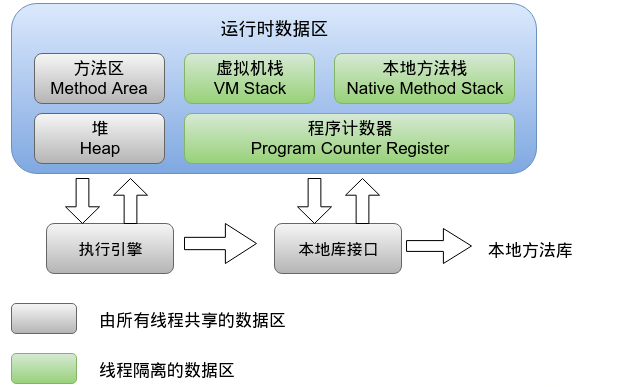
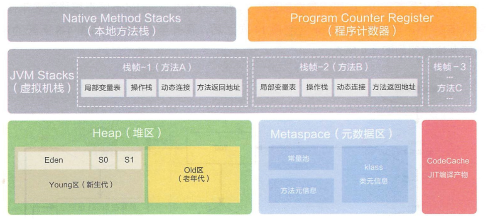
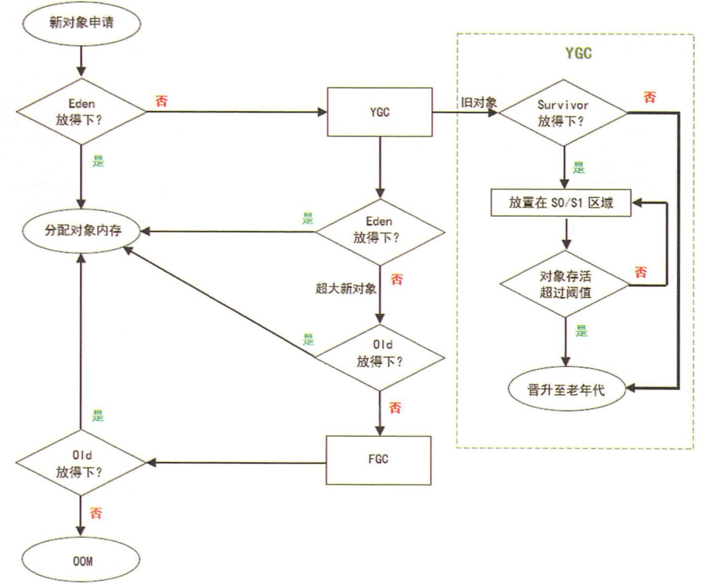

[toc]


参考文章：

JVM内存——https://blog.csdn.net/xishanxinyue/article/details/15336551

JVM设置说明——https://www.cnblogs.com/mingforyou/p/2378143.html

https://www.nowcoder.com/discuss/151138?type=1 	

------

内存是非常重要的系统资源，是硬盘和CPU的中间仓库及桥梁，承载着操作系统和应用程序的实时运行

JVM内存布局规定了Java在运行过程中内存申请、分配、管理的策略，保证了JVM的高效稳定运行

JAVA程序和C类程序一个重要的区别就是JAVA中的内存回收管理工作有JVM完成，而不需要为程序中的每个new/malloc去delete/free。

那JVM这么智能怎么还有内存溢出问题呢，一个常见的原因是我们的JAVA程序中长时间的持有了不该持有的对象，或者申请了过多的对象使得JVM的内存不够用。
（1、长时间持有。2、申请的太多）

##  JVM内存模型

JVM管理的几个内存区域包括以下几个内存区域：





1、  方法区：

用于存储JAVA类信息、常量、静态变量。这个区域也可以发生垃圾回收，比如当一些类不在被引用时JVM可以卸载这个类，不过这种回收动作很少发生。

另外所有线程都共享方法区，因此线程对方法区的访问被设计为线程安全的。

2、  虚拟机栈：

JAVA虚拟机栈是线程私有的，每当启动一个新线程时，JVM都会为它分配一个JAVA虚拟机栈。

每当线程调用方法时，JVM都会为虚拟机栈压入一个栈帧，该栈帧用于存储参数、局部变量、中间运算结果、方法出口等。

3、  本地方法栈：

和虚拟机栈类似，只是他是专为JAVA中的Native方法服务。

当线程进入本地方法后，它已经脱离的JVM的限制，甚至可以直接使用本地处理器中的寄存器。实际上本地方法的调用机制非常依赖于JVM的具体实现。

4、  堆：(重点)

由JVM启动时创建，由所有线程共享，用于存放对象的实例。一般情况下它是JVM中管理的内存中最大的一块。绝大部分JVM内存问题都发生在这一块。

5、  程序计数器：

同虚拟机栈一样，它也是线程私有，启动线程是创建。程序计数器的中保存的内容总是下一条将被执行的指令的地址。

###  OOM常见问题

这几个内存区域，除了程序计数器区域外，其他几个区域都有可能发生内存溢出问题。常见的内存溢出有两种：

1、方法区溢出。

出现该问题时，JVM会报如下类似错误：java.lang.OutOfMemoryError : PermGenSpace ，Perm区的最大内存大小可以通过-XX:MaxPermSize=指定。

引起这类内存溢出原因一般有两个，一个是常量池太大，一个是需要加载的CLASS类太多。出现问题的时候排查下这两种可能性，问题可以很快找到。这类问题程序稳定后也很少出现。

2、堆内存溢出。

（1）在JVM可使用的最大堆内存可以在启动的时候通过-Xmx参数指定。

（2）堆内存溢出是最为常见的内存溢出问题，发生堆内存溢出时，JVM会报告如下错误：java.lang.OutOfMemoryError : java heap space。

这里列举下在定位堆内存溢出时，常见的方法和思路。

堆内存溢出顾名思义就是，堆内存不够用了，如果程序设计的最堆内存已经耗尽，那说明程序设计存在问题，不该申请很多内存的逻辑申请了很多的内存，该释放的对象没有释放。
最重要的问题是就要要找出到底是什么对象没有及时释放，导致占用了过多的内存。

## 堆

Heap是OOM故障最主要的发源地，它存储着几乎所有的实例对象，堆由垃圾收集器自动回收，堆区由各子线程共享使用
通常情况下，它占用的空间是所有内存区域中最大的，但如果无节制地创建大量对象，也容易消耗完所有的空间
堆的内存空间既可以固定大小，也可运行时动态地调整，通过如下参数设定初始值和最大值，比如

```
-Xms256M. -Xmx1024M
```


其中-X表示它是JVM运行参数

- ms是memory start的简称 最小堆容量
- mx是memory max的简称 最大堆容量


但是在通常情况下，服务器在运行过程中，堆空间不断地扩容与回缩，势必形成不必要的系统压力，所以在线上生产环境中，JVM的Xms和Xmx设置成一样大小，避免在GC后调整堆大小时带来的额外压力。

**堆分成两大块:新生代和老年代**

对象产生之初在新生代，步入暮年时进入老年代，但是老年代也接纳在新生代无法容纳的超大对象

**新生代= 1个Eden区+ 2个Survivor区**

绝大部分对象在Eden区生成，当Eden区装填满的时候，会触发Young GC。垃圾回收的时候，在Eden区实现清除策略，没有被引用的对象则直接回收。依然存活的对象会被移送到Survivor区，这个区真是名副其实的存在。

Survivor 区分为S0和S1两块内存空间，送到哪块空间呢?每次Young GC的时候，将存活的对象复制到未使用的那块空间，然后将当前正在使用的空间完全清除，交换两块空间的使用状态。

如果YGC要移送的对象大于Survivor区容量上限，则直接移交给老年代

假如一些没有进取心的对象以为可以一直在新生代的Survivor区交换来交换去，那就错了。每个对象都有一个计数器，每次YGC都会加1。

```
-XX:MaxTenuringThreshold
```

参数能配置计数器的值到达某个阈值的时候，对象从新生代晋升至老年代。如果该参数配置为1,那么从新生代的Eden区直接移至老年代。默认值是15，可以在Survivor 区交换14次之后，晋升至老年代




若Survivor区无法放下，或者超大对象的阈值超过上限，则尝试在老年代中进行分配;

如果老年代也无法放下，则会触发Full Garbage Collection(Full GC);

如果依然无法放下，则抛OOM.

堆出现OOM的概率是所有内存耗尽异常中最高的

出错时的堆内信息对解决问题非常有帮助，所以给JVM设置运行参数，让JVM遇到OOM异常时能输出堆内信息

```
XX:+HeapDumpOnOutOfMemoryError
```


在不同的JVM实现及不同的回收机制中，堆内存的划分方式是不一样的

存放所有的类实例及数组对象

除了实例数据，还保存了对象的其他信息，如Mark Word（存储对象哈希码，GC标志，GC年龄，同步锁等信息），Klass Pointy(指向存储类型元数据的指针）及一些字节对齐补白的填充数据（若实例数据刚好满足8字节对齐，则可不存在补白）

### 特点

Java虚拟机所需要管理的内存中最大的一块.

堆内存物理上不一定要连续,只需要逻辑上连续即可,就像磁盘空间一样.

堆是垃圾回收的主要区域,所以也被称为GC堆.

堆的大小既可以固定也可以扩展,但主流的虚拟机堆的大小是可扩展的(通过-Xmx和-Xms控制),因此当线程请求分配内存,但堆已满,且内存已满无法再扩展时,就抛出OutOfMemoryError.

线程共享:整个Java虚拟机只有一个堆,所有的线程都访问同一个堆.

它是被所有线程共享的一块内存区域,在虚拟机启动时创建.

而程序计数器、Java虚拟机栈、本地方法栈都是一个线程对应一个.


