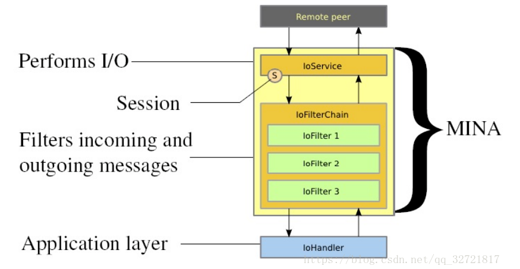

https://blog.csdn.net/qq_32721817/article/details/81383426


NIO API是在Java 1.4引入的。MINA是基于NIO编写的。首先要了解NIO与BIO的概念以及区别，NIO代表非阻塞IO，BIO代表着阻塞式IO。具体细节请百度。。。


MINA是一个简单但功能齐全的网络应用框架（其实已经被NettyPK掉了，但都是一类型的东西，很多东西相通的，因为我们单位在用MINA所以优先看这个）。下载地址：http://mina.apache.org/downloads-mina.html  或者在maven中添加：


```java
        <dependency>
            <groupId>org.slf4j</groupId>
            <artifactId>slf4j-api</artifactId>
            <version>1.6.6</version>
            <type>jar.sha256</type>
        </dependency>
        <dependency>
            <groupId>org.slf4j</groupId>
            <artifactId>slf4j-log4j12</artifactId>
            <version>1.6.6</version>
        </dependency>
        <dependency>
            <groupId>org.rxtx</groupId>
            <artifactId>rxtx</artifactId>
            <version>2.1.7</version>
            <scope>provided</scope>
        </dependency>
        <dependency>
            <groupId>log4j</groupId>
            <artifactId>log4j</artifactId>
            <version>1.2.17</version>
        </dependency>
        <dependency>
            <groupId>org.apache.mina</groupId>
            <artifactId>mina-core</artifactId>
            <version>2.0.7</version>
        </dependency>
        <dependency>
```


## MINA的使用流程：

编写自己的IoService，在这里我们创建IoService的子类。随后编写不同的过滤器（例如关于编解码的过滤器），将这些过滤器添加到过滤器链中，设置当前IoService监听的端口（可以是多个），设置处理器也就是业务逻辑编写的地方。

### MINA说明：

当客户端向这一端口发送消息，IoService会监听这个端口，并经过过滤链进行处理后，传给IoHandler，在这个处理器中有很多函数，这些函数会在不同情况下触发（连接建立时、接收到消息时、连接关闭时、连接超时时等等）。你需要重写你需要的方法，在里面编写你的业务逻辑。

